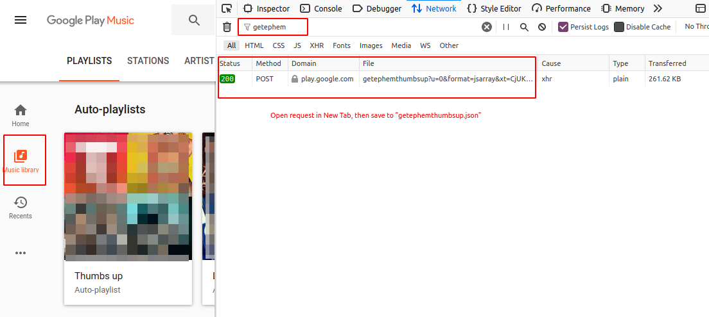

# GPMplaylistDL
Google Play Music playlist downloader, forked from @fattredd: https://gist.github.com/fattredd/8b41590dfaf4bd819fa92dea0df216d2

[Reddit post](https://www.reddit.com/r/DataHoarder/comments/8io4jv/google_play_music_playlist_downloader/)

This is a little script to download every song from every playlist
in your Google Play Music account. Songs are organized as follows:

```sh
<artist>/<album>/<song number> <song name>.mp3
```

I Highly recomend putting this file in your %USER%\Music folder
before running.

Please note that this will ONLY work if you have a subscription,
and a mobile device associated with your account.

Requirements:
- gmusicapi
- requests

For further documentation on what I'm using here, check out:
http://unofficial-google-music-api.readthedocs.io/en/latest/reference/mobileclient.html

## Instructions
Install python 3 and pip 3 (`python3-pip` on Debian)

Once you have these installed, you'll need some python packages. You can install these from the command line with:

```sh
python3 -m venv env
source env/bin/activate
pip3 install -r requirements.txt
```

* Copy `config.py.default` to `config.py`
* Add your username and password to where the variables are set
* If you _don't_ want to download a playlist, add it to the `IGNORE_PLAYLISTS` array as a string
* Change the music directory, too, if you want files to be downloaded to a
  separate folder. Music will be put into an Artist folder, then a sub-folder
  for each Album, then each song labeled by Title. An artist and album cover will
  be included if possible, and each song will come with a JSON file containing
  metadata from Google about the song.
* If you want to download your Thumbs Up auto-playlist music, do the following:
    1. Open Google Play Music in a browser on the desktop
    2. Open the browser dev tools with Right Click -> Inspect or `F12`
    3. Click on the Network tab
    4. In the Filter box, type `getephemthumbsup`
    5. Click on the Music Library tab in GPM
    6. If you see an entry in the Network tab, right click it and "Open
       in new tab"
    7. Save the new tab to the file `getephemthumbsup.json` and place in
       the same directory as this code.



Then navigate to your music directory and run the script with:

```sh
python3 GPMplaylistDL3.py
```

If a song already exists, it will not be re-downloaded. HOWEVER, if you move
the file or reorganize the list, this tool will be unable to find it and it will
download a copy.

Additional note: some songs give a 404 not found. I don't know what causes this,
but it may be because I've added a song from my "offline library" to a playlist.
I believe you can download those songs using Google's own "Music Manager" application:
https://support.google.com/googleplaymusic/answer/1075570?hl=en